# AI Outbound Sales

Multi-role SaaS workspace for **Admin**, **Manager**, and **Agent** teams — outbound lead management, human browser calling, AI voice campaigns, live attendance, leave workflows, and role-scoped analytics.

**Stack:** Flask · PostgreSQL · Next.js 16 · TypeScript · Tailwind CSS · Twilio · OpenAI

---

## What this project does

| Area | Description |
|------|-------------|
| **Organization setup** | Admin registers, creates managers and agents, uploads outbound leads, assigns work |
| **Outbound operations** | Human agents dial from the browser; AI agents run scripted voice flows via Twilio |
| **Performance cockpit** | Shared KPI ribbons, pillar breakdowns, call-outcome grids, pipeline charts, and drill-down workspaces |
| **Attendance** | Login/logout sessions, 9-hour daily target, live presence, manager/admin review |
| **Leaves** | Submit, approve/decline, email notifications, org-wide history for admins |
| **Call flows** | Manager/agent-authored AI scripts; admin approval before production use |

Every role sees only data in their scope: admin → org, manager → team, agent → self.

---

## Exel File Architecture
```
company_name	contact_person	phone	email	industry	website	city	linkedin
Dubey and Sons	Sara Verma	7960030324	egoel@sethi.info	Telecom	https://dubeyandsons.com	Rajpur Sonarpur	https://linkedin.com/in/sara-verma
Bahri, Anand and Date	Shaan Yohannan	5702645458	jivingarg@sinha-shenoy.com	Education	https://bahrianandanddate.com	Rewa	https://linkedin.com/in/shaan-yohannan
Bora-Upadhyay	Mohanlal Bandi	06014490333	kairasuri@sarma.net	Marketing	https://bora-upadhyay.com	Jorhat	https://linkedin.com/in/mohanlal-bandi
```

## Architecture

```
Browser (Next.js 16)
    │
    ├─ App Router pages  (/admin, /manager, /agent)
    ├─ API route proxies  (/api/* → Flask backend)
    └─ Auth gate          (src/proxy.ts — role cookies)
            │
            ▼
Flask API (port 8000)
    │
    ├─ Blueprints         auth, team, outbound, dashboards, attendance, leaves, call flows, Twilio webhooks
    ├─ Services           business logic, stats, email, Twilio/OpenAI integrations
    └─ SQLAlchemy models  PostgreSQL (schema auto-migrated on startup)
```

**Frontend pattern:** Pages are thin; heavy UI lives in `src/components/`. Dashboards reuse a shared **exec cockpit** layer (`cockpit/` — header, KPI ribbon, deferred chart sections, pillar cards). API clients live in `src/lib/` per domain.

**Backend pattern:** Routes validate auth + scope, delegate to `services/`, return JSON. Pagination uses shared `app/utils/pagination.py`.

---

## Role capabilities

| Module | Admin | Manager | Agent |
|--------|:-----:|:-------:|:-----:|
| Managers & agents CRUD | ✓ | agents only | — |
| Outbound lead upload & assignment | ✓ | ✓ | assigned leads |
| Human browser calling | review logs | team logs | dial workspace |
| AI call flows & queue | approve flows | create flows | run assigned flows |
| Dashboard analytics & KPIs | org + drill-down | team + drill-down | personal cockpit |
| Agent performance workspace | ✓ | ✓ | — |
| Attendance (9 hr target, sessions) | org view | team + self | self |
| Leave requests & approvals | org | team agents | self |
| Organization-scoped data | ✓ | team only | self only |

---

## Agent types

| Type | `call_mode` | Behavior |
|------|-------------|----------|
| **Outbound human** | `human` | Browser dialer (Twilio Client), call logs, connect/no-answer outcomes |
| **Outbound AI** | `ai` | Automated Twilio + OpenAI scripted calls, success/declined/dropped outcomes |

Dashboards, KPI cards, and workspace layouts adapt automatically based on handler type.

---

## Project structure

```
AI-Agents-SAAS/
├── backend/
│   ├── app.py                 # Dev server + WSGI entry (`app:app`)
│   ├── gunicorn.conf.py       # Production multi-worker config
│   ├── app/
│   │   ├── api/               # Flask blueprints (REST endpoints)
│   │   ├── core/              # Config, JWT, security, constants
│   │   ├── extensions/        # Startup schema migrations
│   │   ├── models/            # SQLAlchemy ORM
│   │   ├── routes/            # Health check
│   │   ├── schemas/           # Pydantic request/response models
│   │   ├── services/          # Business logic
│   │   └── utils/             # Shared helpers (pagination, names, rate limit, …)
│   ├── scripts/               # CLI utilities (seed admin, hash password, DB check)
│   └── requirements.txt
├── frontend/
│   ├── src/
│   │   ├── app/               # Next.js routes + /api proxies
│   │   ├── components/        # UI by domain (dashboard, outbound, attendance, …)
│   │   ├── hooks/             # Data fetching, polling, call state
│   │   ├── lib/               # Typed API clients, auth, constants
│   │   └── proxy.ts           # Role-based auth gate (replaces middleware.ts)
│   └── scripts/               # Playwright screenshot capture
└── docs/
    ├── screenshots/           # README panel snapshots
    └── samples/               # Sample CSV for lead upload
```

### Key frontend modules

| Path | Purpose |
|------|---------|
| `components/dashboard/cockpit/` | Shared exec dashboard shell — KPI ribbon, header, page layout, role KPI builders |
| `components/dashboard/admin-cockpit/` | Admin-specific charts, pillar cards, reference panels (used by shared cockpit) |
| `components/dashboard/cockpit/agent-performance-cockpit-sections.tsx` | Admin/manager agent drill-down workspace |
| `components/outbound/` | Lead tables, human dialer, call logs, AI queue |
| `components/attendance/` | Sessions, 9-hour progress, presence strip |
| `lib/auth/` | Cookie auth, server/client helpers, role layout gates |

### Key backend blueprints

| Blueprint | Scope |
|-----------|--------|
| `auth` | Login, register, logout, JWT cookies |
| `team` / `manager_team` | Admin/manager CRUD for managers & agents |
| `admin_outbound` / `manager_outbound` / `agent_outbound` | Leads, assignment, filters |
| `admin_dashboard` / `manager_dashboard` / `agent_dashboard` | Stats, analytics, call logs |
| `attendance` | Sessions, presence, daily targets |
| `leaves` | Requests, approvals, history |
| `call_flows` | AI script builder + approval |
| `twilio_webhooks` | Voice status, gather, browser outbound |

---

## Sign in & portals

<table>
  <tr>
    <td align="center" width="50%">
      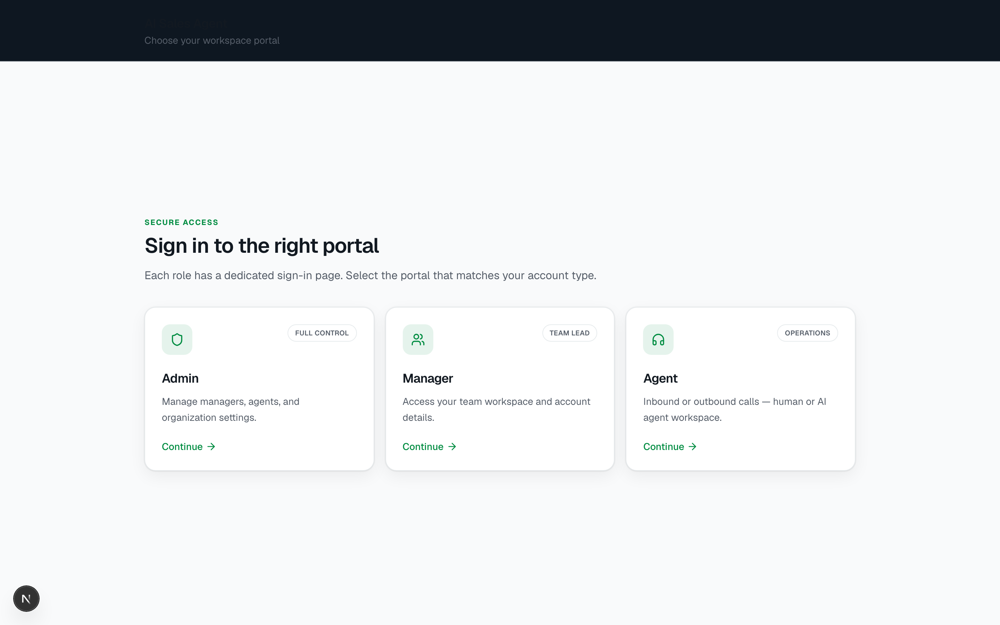
      <br /><br />
      <strong>Portal chooser</strong>
      <br />
      <sub>Pick Admin, Manager, or Agent workspace</sub>
    </td>
    <td align="center" width="50%">
      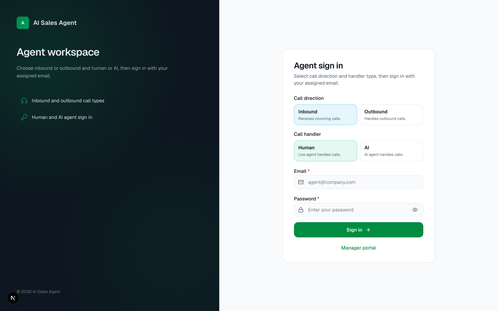
      <br /><br />
      <strong>Agent login</strong>
      <br />
      <sub>Human / AI handler selection</sub>
    </td>
  </tr>
</table>

### Login URLs

| Role | URL |
|------|-----|
| Portal | http://localhost:3000/login |
| Admin | http://localhost:3000/admin/login |
| Admin register | http://localhost:3000/admin/register |
| Organization | http://localhost:3000/organization/login |
| Manager | http://localhost:3000/manager/login |
| Agent | http://localhost:3000/agent/login |

---

## Dashboard previews

<table>
  <tr>
    <td align="center" width="33%">
      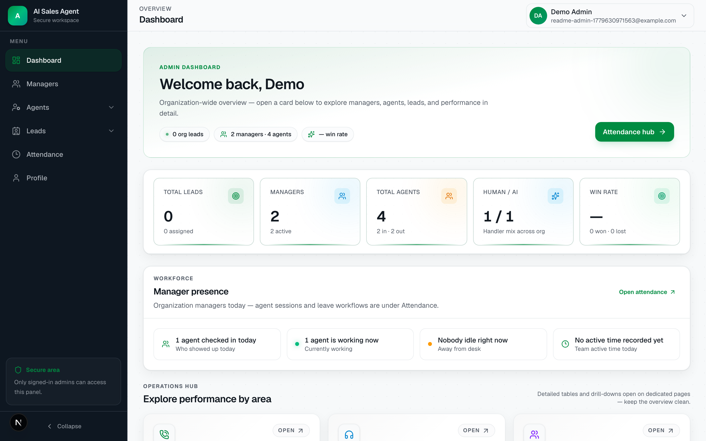
      <br /><br />
      <strong>Admin dashboard</strong>
      <br />
      <sub>Org KPIs, manager presence, analytics hub</sub>
    </td>
    <td align="center" width="33%">
      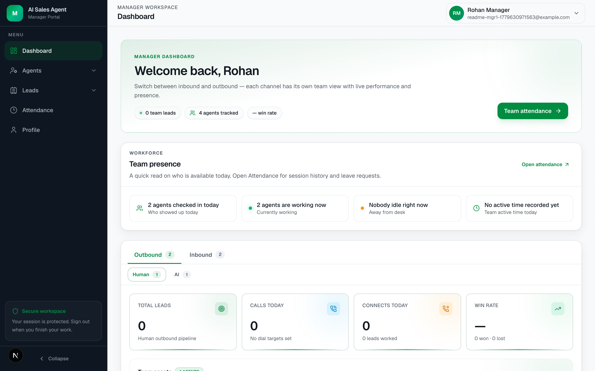
      <br /><br />
      <strong>Manager dashboard</strong>
      <br />
      <sub>Team KPIs, human/AI handler tabs, live presence</sub>
    </td>
    <td align="center" width="33%">
      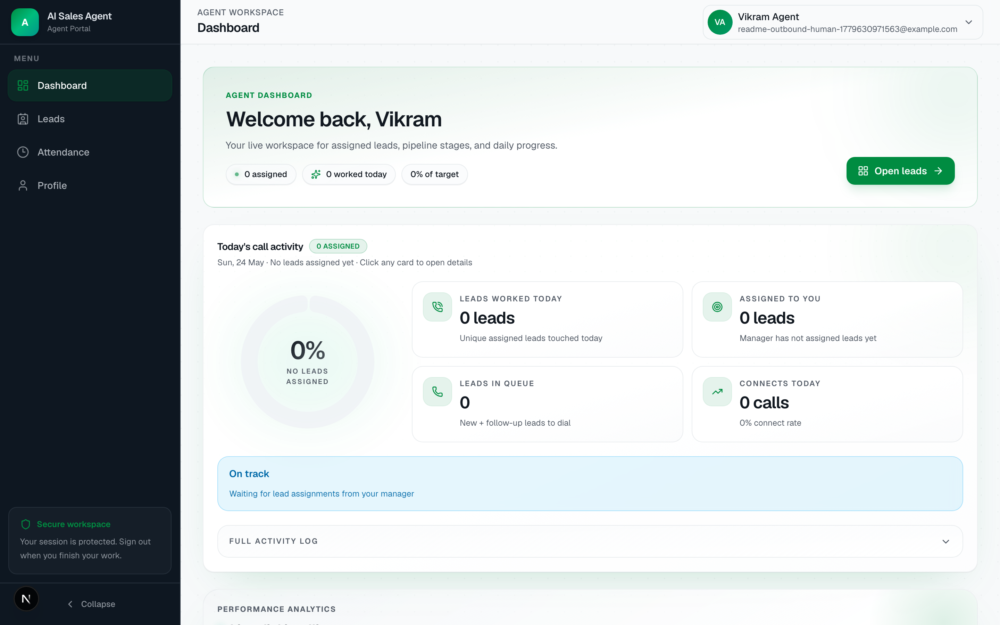
      <br /><br />
      <strong>Agent dashboard</strong>
      <br />
      <sub>Dial targets, pipeline stages, call outcomes</sub>
    </td>
  </tr>
</table>

---

## Attendance & leaves

<table>
  <tr>
    <td align="center" width="33%">
      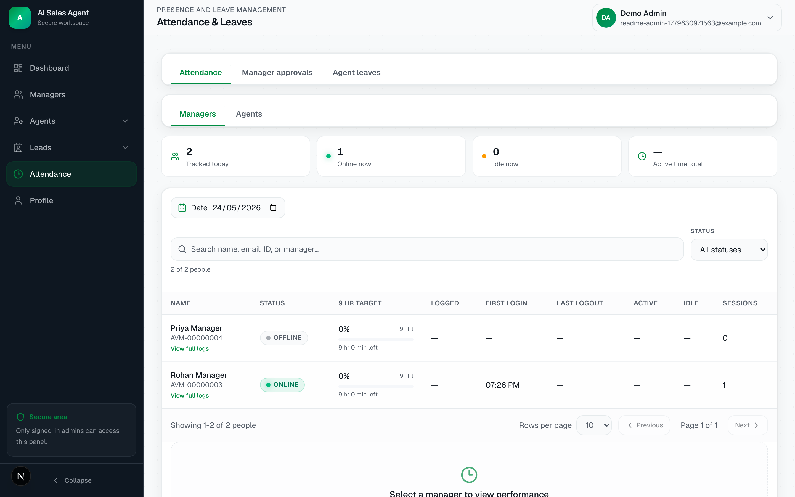
      <br /><br />
      <strong>Admin · Attendance</strong>
    </td>
    <td align="center" width="33%">
      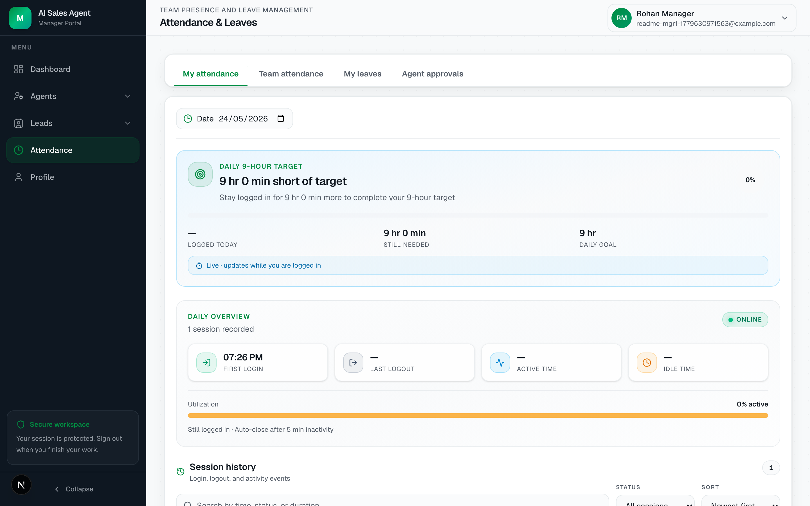
      <br /><br />
      <strong>Manager · Attendance</strong>
    </td>
    <td align="center" width="33%">
      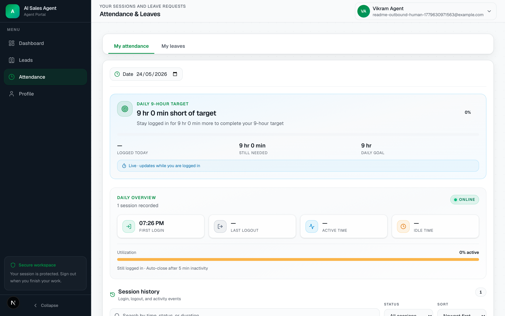
      <br /><br />
      <strong>Agent · Attendance</strong>
    </td>
  </tr>
</table>

---

## Admin & manager workspaces

<table>
  <tr>
    <td align="center" width="33%">
      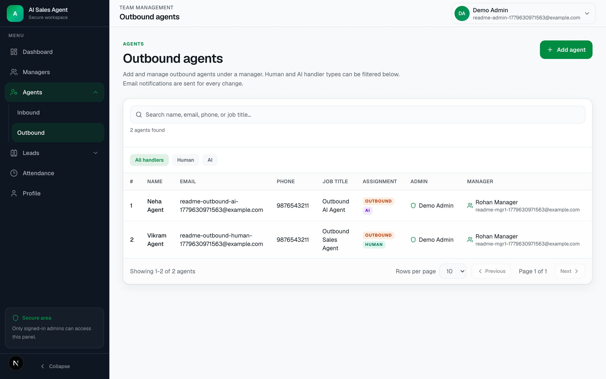
      <br /><br />
      <strong>Agents</strong>
    </td>
    <td align="center" width="33%">
      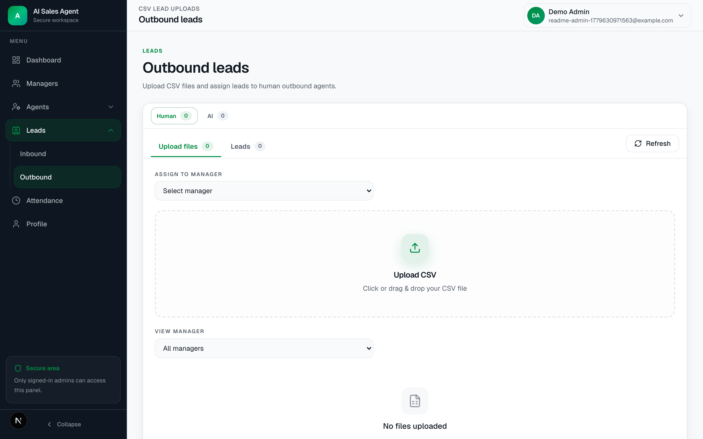
      <br /><br />
      <strong>Leads</strong>
    </td>
    <td align="center" width="33%">
      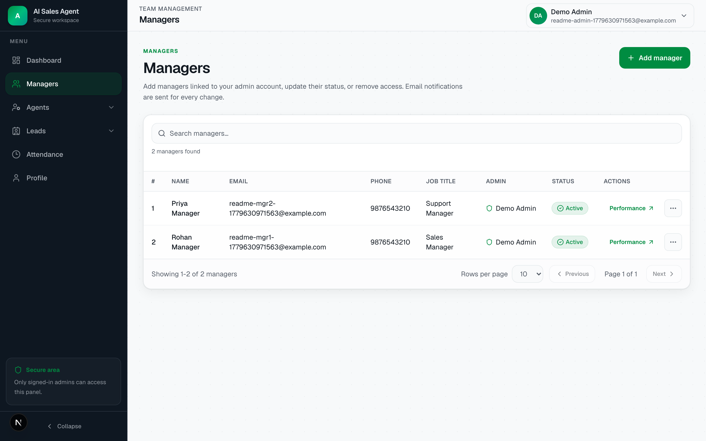
      <br /><br />
      <strong>Managers</strong>
    </td>
  </tr>
</table>

<table>
  <tr>
    <td align="center" width="50%">
      
      <br /><br />
      <strong>Manager · Team agents</strong>
    </td>
    <td align="center" width="50%">
      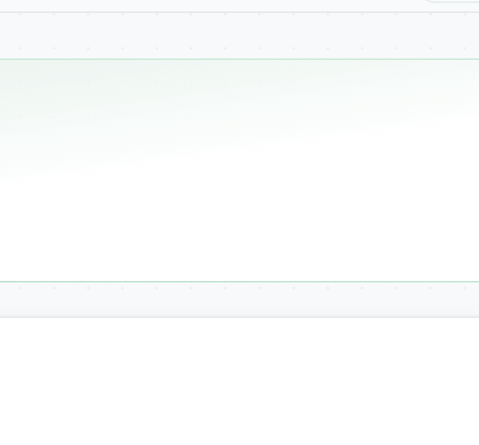
      <br /><br />
      <strong>Reporting chain</strong>
    </td>
  </tr>
</table>

---

## Run locally

### Prerequisites

- Python 3.11+
- Node.js 20+
- PostgreSQL (local or AWS RDS)

### 1. Clone and configure environment

```bash
git clone <your-repo-url>
cd ai-inbound-sales-react-python
```

Copy example env files and fill in your values (see **Environment variables** below):

```bash
cp backend/.env.example backend/.env
cp frontend/.env.local.example frontend/.env.local
```

> **Important:** `backend/.env` contains secrets (DB password, Twilio, OpenAI, SMTP, S3). It is listed in `.gitignore` — do not commit it.

### 2. Backend (port 8000)

```bash
cd backend
python -m venv .venv
source .venv/bin/activate   # Windows: .venv\Scripts\activate
pip install -r requirements.txt
python app.py
```

Schema tables and indexes are created/updated automatically on startup.

**Optional — create first admin from CLI** (instead of `/admin/register`):

```bash
python scripts/seed_admin.py
```

**Production:**

```bash
gunicorn -c gunicorn.conf.py app:app
```

### 3. Frontend (port 3000)

Open a **second terminal**:

```bash
cd frontend
npm install
npm run dev
```

Open http://localhost:3000/login

| Command | Description |
|---------|-------------|
| `npm run dev` | Development server |
| `npm run build` | Production build |
| `npm run start` | Serve production build |
| `npm run lint` | ESLint |

### 4. Recommended setup order

After backend + frontend are running:

1. **Admin** — register at `/admin/register` or run `scripts/seed_admin.py`
2. **Organization** — Admin → Organizations → Add organization (company login)
3. **Manager** — Admin → Managers → pick organization → Add manager
4. **Agent** — Admin → Agents → pick organization → pick manager → Add agent

Agents cannot be created until at least one organization and one active manager exist.

---

## Environment variables

All platform integrations (Twilio, OpenAI, SMTP, S3) live in **`backend/.env`**.  
Organizations only get company name, email, and password for their portal login.

### Backend — `backend/.env`

Copy from `backend/.env.example`:

```bash
cp backend/.env.example backend/.env
```

#### Database (required)

| Variable | Required | Example | Description |
|----------|:--------:|---------|-------------|
| `POSTGRES_USER` | Yes | `myuser` | PostgreSQL username |
| `POSTGRES_PASSWORD` | Yes | `secret` | PostgreSQL password |
| `POSTGRES_DB` | Yes | `zyvom` | Database name |
| `POSTGRES_HOST` | Yes | `localhost` or RDS host | Database host |
| `POSTGRES_PORT` | No | `5432` | Database port (default `5432`) |
| `POSTGRES_SSLMODE` | No | `require` | SSL mode; use `require` for RDS, `prefer` for local |
| `DATABASE_URL` | No | — | Full SQLAlchemy URL; overrides `POSTGRES_*` if set |

#### Auth & app (required)

| Variable | Required | Example | Description |
|----------|:--------:|---------|-------------|
| `SECRET_KEY` | Yes | long random string (32+ chars in production) | Flask session signing and JWT |
| `JWT_EXPIRE_DAYS` | No | `7` | Login cookie lifetime in days |
| `APP_NAME` | No | `AI Sales Agent` | App name shown in emails |
| `APP_URL` | Yes | `http://localhost:3000/admin/login` | Public login URL used in welcome emails; use HTTPS in production |
| `CORS_ORIGINS` | No | `http://localhost:3000,http://127.0.0.1:3000` | Allowed frontend origins (comma-separated) |

#### Email / SMTP (required for notifications)

| Variable | Required | Example | Description |
|----------|:--------:|---------|-------------|
| `EMAIL_HOST` | Yes* | `smtp.gmail.com` | SMTP server (`SMTP_HOST` alias also works) |
| `EMAIL_PORT` | No | `587` | SMTP port |
| `EMAIL_USER` | Yes* | `you@gmail.com` | SMTP login; must match authenticated sender |
| `EMAIL_PASS` | Yes* | Gmail App Password | SMTP password (`EMAIL_PASSWORD` / `SMTP_PASSWORD` aliases work) |
| `EMAIL_FROM` | Yes* | `"AI Sales Agent <you@gmail.com>"` | From header in emails |
| `EMAIL_REPLY_TO` | No | `you@gmail.com` | Reply-To address |
| `EMAIL_USE_TLS` | No | `true` | Enable STARTTLS |

\*Required if you want welcome emails, password change emails, leave notifications, etc.

#### Twilio (required for voice / browser calling)

| Variable | Required | Example | Description |
|----------|:--------:|---------|-------------|
| `TWILIO_ACCOUNT_SID` | Yes* | `ACxxxxxxxx` | Twilio account SID |
| `TWILIO_AUTH_TOKEN` | Yes* | `xxxxxxxx` | Twilio auth token |
| `TWILIO_PHONE_NUMBER` | Yes* | `+19596007203` | Outbound caller ID |
| `PHONE_COUNTRY_CODE` | No | `91` | Default country code for 10-digit numbers |
| `TWILIO_WEBHOOK_BASE_URL` | Yes* | `https://xxxx.ngrok-free.dev` | Public HTTPS URL Twilio can reach; local dev: `ngrok http 8000` |
| `TWILIO_API_KEY_SID` | No | — | Optional Twilio API key for browser Client SDK |
| `TWILIO_API_KEY_SECRET` | No | — | Optional API key secret |
| `TWILIO_TWIML_APP_SID` | No | — | Optional TwiML App SID for browser outbound |

\*Required only if using calling features.

#### OpenAI (required for AI voice flows)

| Variable | Required | Example | Description |
|----------|:--------:|---------|-------------|
| `OPENAI_API_KEY` | Yes* | `sk-proj-...` | OpenAI API key for AI call scripts |

\*Required only if using AI outbound calling.

#### AWS S3 (optional — call recording archive)

| Variable | Required | Example | Description |
|----------|:--------:|---------|-------------|
| `S3_ACCESS_KEY` | No | `AKIA...` | AWS access key |
| `S3_SECRET_KEY` | No | `...` | AWS secret key |
| `S3_BUCKET_NAME` | No | `my-bucket` | S3 bucket for recordings |
| `S3_REGION` | No | `ap-south-1` | AWS region |
| `S3_RECORDINGS_PREFIX` | No | `human-call-recordings` | Folder prefix inside bucket |

#### Server / dev (optional)

| Variable | Default | Description |
|----------|---------|-------------|
| `PORT` | `8000` | Flask dev server port |
| `FLASK_DEBUG` | `1` | Enable Flask debug mode (`0` in production) |
| `FLASK_THREADED` | `1` | Threaded dev server |
| `DB_POOL_SIZE` | `10` | SQLAlchemy connection pool size |
| `DB_MAX_OVERFLOW` | `20` | Extra connections beyond pool |
| `DB_POOL_RECYCLE_SECONDS` | `1800` | Recycle pooled connections |
| `DB_STATEMENT_TIMEOUT_MS` | `30000` | PostgreSQL statement timeout |

#### Example minimal `backend/.env`

```env
POSTGRES_USER=your_user
POSTGRES_PASSWORD=your_password
POSTGRES_DB=your_db
POSTGRES_HOST=localhost
POSTGRES_PORT=5432

SECRET_KEY=replace-with-a-long-random-string-at-least-32-chars
JWT_EXPIRE_DAYS=7

APP_NAME=AI Sales Agent
APP_URL=http://localhost:3000/admin/login

EMAIL_HOST=smtp.gmail.com
EMAIL_PORT=587
EMAIL_USER=your-email@gmail.com
EMAIL_PASS=your-gmail-app-password
EMAIL_FROM="AI Sales Agent <your-email@gmail.com>"
EMAIL_USE_TLS=true

TWILIO_ACCOUNT_SID=
TWILIO_AUTH_TOKEN=
TWILIO_PHONE_NUMBER=
PHONE_COUNTRY_CODE=91
TWILIO_WEBHOOK_BASE_URL=https://your-ngrok-url.ngrok-free.dev

OPENAI_API_KEY=

S3_ACCESS_KEY=
S3_SECRET_KEY=
S3_BUCKET_NAME=
S3_REGION=ap-south-1
S3_RECORDINGS_PREFIX=human-call-recordings
```

See `backend/.env.example` for inline comments.

### Frontend — `frontend/.env.local`

Copy from `frontend/.env.local.example`:

```bash
cp frontend/.env.local.example frontend/.env.local
```

| Variable | Required | Example | Description |
|----------|:--------:|---------|-------------|
| `BACKEND_URL` | Yes | `http://127.0.0.1:8000` | Flask API base URL used by Next.js `/api/*` proxies |

---

## Git ignore

The repo root `.gitignore` (plus `backend/.gitignore` and `frontend/.gitignore`) excludes:

- `.env` and other secret files
- Python virtualenv (`.venv/`), `__pycache__/`
- Node modules and Next.js build output (`.next/`)
- OS and IDE junk (`.DS_Store`, `.idea/`, `.vscode/`)

Always use `.env.example` / `.env.local.example` as templates — never commit real credentials.

---

## Security

- Separate httpOnly JWT cookies per role: `admin_token`, `manager_token`, `agent_token`
- Next.js `src/proxy.ts` redirects unauthenticated users away from protected routes
- API route handlers forward cookies to Flask; unauthenticated requests fail fast
- Admin data scoped to their organization; managers see only their team; agents see only assigned data
- Rate limiting on sensitive auth endpoints (`app/utils/rate_limit.py`)

---

## Email notifications

Transactional email via SMTP. Configure `EMAIL_HOST`, `EMAIL_USER`, `EMAIL_PASS`, and `EMAIL_FROM`.

| Event | Recipient |
|-------|-----------|
| Admin registration | New admin |
| Manager / agent created | New team member (credentials + login link) |
| Account blocked / unblocked | Team member |
| Account deleted | Team member |
| Leave submitted / updated / cancelled | Assigned reviewer |
| Leave approved / declined | Requester |
| Outbound lead assigned | Assigned agent |

**Deliverability tips:** use the same address for `EMAIL_USER` and `EMAIL_FROM`, Gmail App Passwords, public HTTPS `APP_URL`, and SPF/DKIM/DMARC on your domain in production.

---

## Backend utility scripts

| Script | Usage |
|--------|--------|
| `scripts/seed_admin.py` | Create admin interactively |
| `scripts/hash_password.py` | Hash a password for manual DB inserts |
| `scripts/set_admin_status.py` | Enable/disable an admin account |
| `scripts/check_db.py` | Test database connectivity |
| `scripts/create_tables.py` | Legacy partial bootstrap (prefer app startup migrations) |

---

## Regenerate README screenshots

Requires backend (8000) and frontend (3000) running:

```bash
cd frontend
npx playwright install chromium
node scripts/capture-readme-screenshots.mjs
```

| File | Page |
|------|------|
| `login-portal.png` | `/login` |
| `agent-login.png` | `/agent/login` |
| `admin-dashboard.png` | `/admin/dashboard` |
| `admin-attendance.png` | `/admin/dashboard/attendance` |
| `admin-managers.png` | `/admin/dashboard/managers` |
| `admin-agents-outbound.png` | `/admin/dashboard/agents/outbound` |
| `admin-outbound-leads.png` | `/admin/dashboard/leads/outbound` |
| `manager-dashboard.png` | `/manager/dashboard` |
| `manager-attendance.png` | `/manager/dashboard/attendance` |
| `manager-agents-outbound.png` | `/manager/dashboard/agents/outbound` |
| `agent-dashboard.png` | `/agent/dashboard` |
| `agent-attendance.png` | `/agent/dashboard/attendance` |
| `agent-reporting-chain.png` | Agent profile · reporting chain |

---

## Sample data

Use `docs/samples/realistic_market_leads_100.csv` to test outbound lead CSV upload from the admin or manager leads page.

---

## Recent cleanup (maintainability)

The codebase was trimmed to reduce duplication and dead weight:

- **Removed unused frontend components:** re-export shims, unwired profile/pace panels, duplicate KPI/chart widgets
- **Consolidated shared cockpit UI** under `components/dashboard/cockpit/` (header, KPI ribbon, exec page shell)
- **Removed duplicate backend entry points** (`run.py`, `app/main.py`) — use `app.py` or Gunicorn
- **Shared pagination helper** at `backend/app/utils/pagination.py`
- **Removed stale `scripts/schema.sql`** — schema is managed by app startup migrations
- **Orphan CSS** for deleted components removed from `globals.css`

When adding features, prefer extending shared cockpit/kit components rather than creating parallel one-off dashboards.
