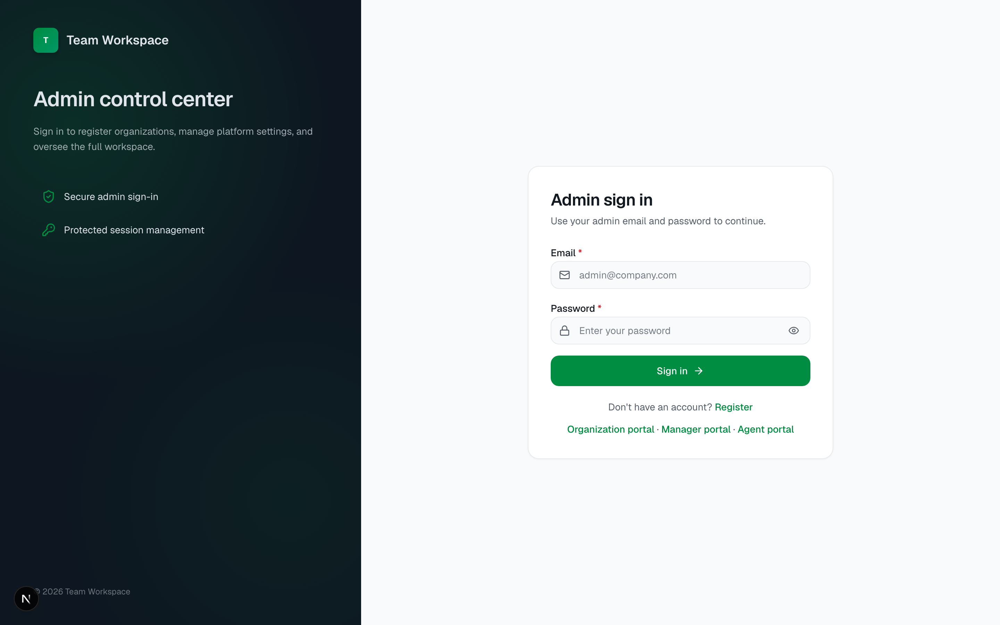
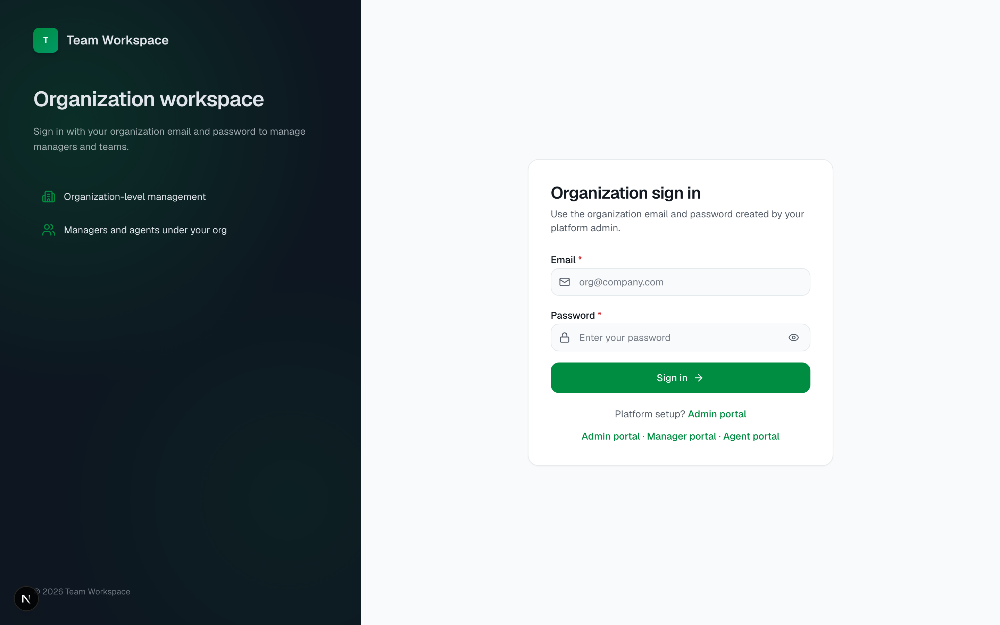
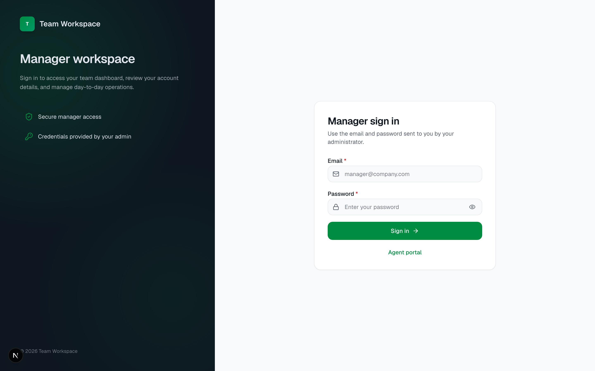
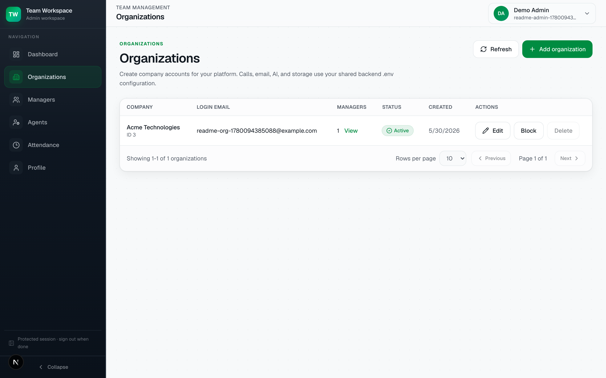
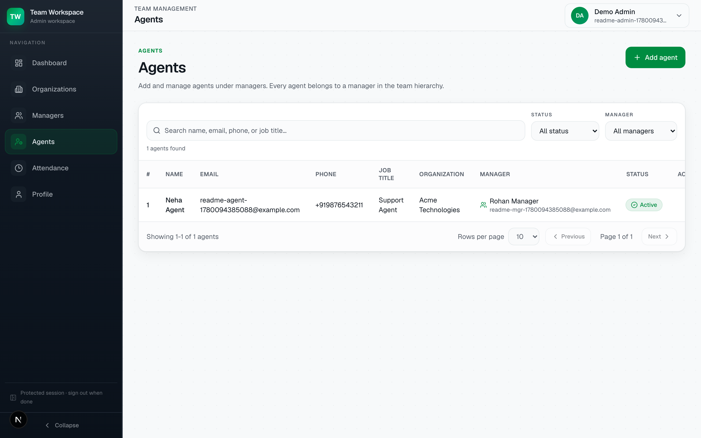
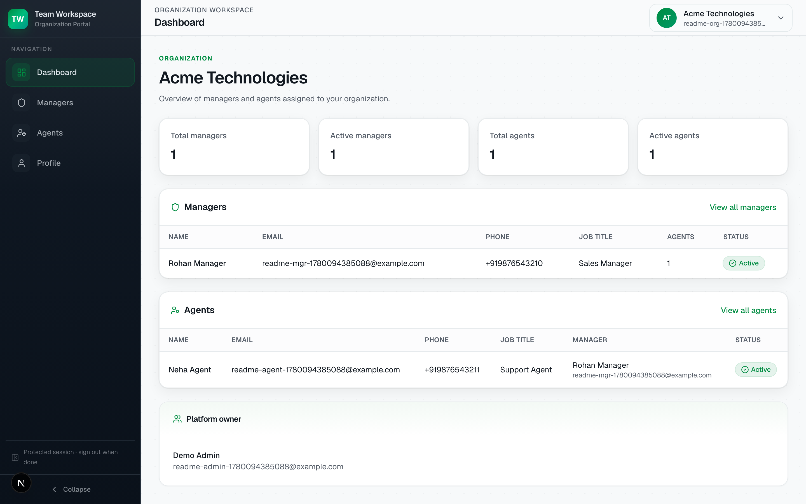
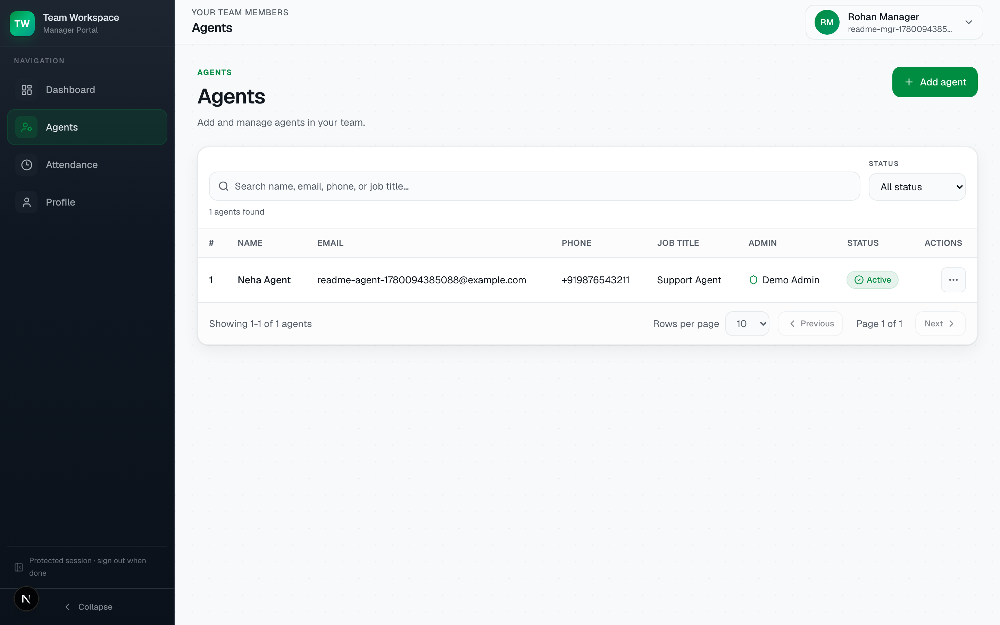

# Team Management Platform

Multi-role web app for managing a company hierarchy:

**Admin → Organization → Manager → Agent**

Each role has its own login portal, dashboard, profile, and scoped permissions. Platform settings (database, auth, email) live in `backend/.env`. Organizations only get company name, email, and password for their portal login.

**Stack:** Flask · PostgreSQL · Next.js 16 · TypeScript · Tailwind CSS

---

## Role hierarchy

```
Admin (platform owner)
  └── Organization (company account)
        └── Manager (team lead)
              └── Agent (team member)
```

| Role | Who creates them | What they manage |
|------|------------------|------------------|
| **Admin** | Self-register or CLI seed | All organizations, managers, agents, attendance |
| **Organization** | Admin | Own managers and agents inside their company |
| **Manager** | Admin or Organization | Agents in their team, team attendance |
| **Agent** | Admin, Organization, or Manager | Own profile and attendance |

**Rule:** Every agent must belong to a manager. Every manager must belong to an organization.

---

## Features (current scope)

| Module | Admin | Organization | Manager | Agent |
|--------|:-----:|:------------:|:-------:|:-----:|
| Organizations CRUD | ✓ | — | — | — |
| Managers CRUD | ✓ | ✓ | — | — |
| Agents CRUD | ✓ | ✓ | ✓ | — |
| Block / unblock / delete | ✓ | ✓ | ✓ | — |
| Profile & change password | ✓ | ✓ | ✓ | ✓ |
| Attendance & leaves | ✓ | — | ✓ | ✓ |
| Welcome / status emails | ✓ | ✓ | ✓ | — |

---

## Architecture

```
Browser (Next.js 16, port 3000)
    │
    ├─ App routes     /admin, /organization, /manager, /agent
    ├─ API proxies    /api/* → Flask backend
    └─ Auth gate      src/proxy.ts (role cookies)
            │
            ▼
Flask API (port 8000)
    │
    ├─ auth             login, register, JWT cookies
    ├─ team             admin manager/agent CRUD
    ├─ organizations    org accounts + org-scoped team
    ├─ attendance       sessions, presence, leaves
    └─ SQLAlchemy       PostgreSQL (auto-migrated on startup)
```

---

## Project structure

```
ai-inbound-sales-react-python/
├── backend/
│   ├── app.py              # Dev server entry
│   ├── gunicorn.conf.py    # Production config
│   ├── app/
│   │   ├── api/            # REST blueprints
│   │   ├── core/           # Config, JWT, security
│   │   ├── extensions/     # Startup migrations
│   │   ├── models/         # SQLAlchemy models
│   │   ├── schemas/        # Pydantic validation
│   │   └── services/       # Business logic
│   ├── scripts/            # seed_admin, hash_password, check_db
│   └── requirements.txt
├── frontend/
│   └── src/
│       ├── app/            # Next.js pages
│       ├── components/     # UI (team, auth, attendance, profile)
│       └── lib/            # API clients, auth, validation
└── docs/
    ├── screenshots/          # README UI previews
    └── samples/              # Optional sample files
```

---

## Login URLs

| Role | URL |
|------|-----|
| Portal chooser | http://localhost:3000/login |
| Admin login | http://localhost:3000/admin/login |
| Admin register | http://localhost:3000/admin/register |
| Organization login | http://localhost:3000/organization/login |
| Manager login | http://localhost:3000/manager/login |
| Agent login | http://localhost:3000/agent/login |

---

## Screenshots

### Login portals

<table>
  <tr>
    <td align="center" width="50%">
      
      <br /><br />
      <strong>Portal chooser</strong>
      <br />
      <sub>Pick Admin, Organization, Manager, or Agent workspace</sub>
    </td>
    <td align="center" width="50%">
      
      <br /><br />
      <strong>Admin login</strong>
    </td>
  </tr>
  <tr>
    <td align="center" width="50%">
      
      <br /><br />
      <strong>Organization login</strong>
    </td>
    <td align="center" width="50%">
      
      <br /><br />
      <strong>Manager login</strong>
    </td>
  </tr>
</table>

<p align="center">
  
  <br /><br />
  <strong>Agent login</strong>
</p>

### Admin workspace

<table>
  <tr>
    <td align="center" width="50%">
      
      <br /><br />
      <strong>Dashboard</strong>
    </td>
    <td align="center" width="50%">
      
      <br /><br />
      <strong>Organizations</strong>
    </td>
  </tr>
  <tr>
    <td align="center" width="50%">
      
      <br /><br />
      <strong>Managers</strong>
    </td>
    <td align="center" width="50%">
      
      <br /><br />
      <strong>Agents</strong>
    </td>
  </tr>
</table>

<p align="center">
  
  <br /><br />
  <strong>Attendance & leaves</strong>
</p>

### Organization, manager & agent

<table>
  <tr>
    <td align="center" width="33%">
      
      <br /><br />
      <strong>Organization dashboard</strong>
    </td>
    <td align="center" width="33%">
      
      <br /><br />
      <strong>Manager dashboard</strong>
    </td>
    <td align="center" width="33%">
      
      <br /><br />
      <strong>Agent dashboard</strong>
    </td>
  </tr>
  <tr>
    <td align="center" width="33%">
      
      <br /><br />
      <strong>Manager · Agents</strong>
    </td>
    <td align="center" width="33%">
      
      <br /><br />
      <strong>Manager · Attendance</strong>
    </td>
    <td align="center" width="33%">
      
      <br /><br />
      <strong>Agent · Attendance</strong>
    </td>
  </tr>
</table>

Regenerate screenshots (backend on `:8000`, frontend on `:3000`):

```bash
cd frontend
npx playwright install chromium
node scripts/capture-readme-screenshots.mjs
```

---

## Run locally

### Prerequisites

- Python 3.11+
- Node.js 20+
- PostgreSQL (local or AWS RDS)

### 1. Clone and configure

```bash
git clone <your-repo-url>
cd ai-inbound-sales-react-python

cp backend/.env.example backend/.env
cp frontend/.env.local.example frontend/.env.local
```

Edit `backend/.env` with your database and email settings (see below).

> **Important:** Never commit `backend/.env` — it is in `.gitignore`.

### 2. Start backend (port 8000)

```bash
cd backend
python -m venv .venv
source .venv/bin/activate   # Windows: .venv\Scripts\activate
pip install -r requirements.txt
python app.py
```

Tables are created/updated automatically on startup.

**Optional — create admin via CLI:**

```bash
python scripts/seed_admin.py
```

**Production:**

```bash
gunicorn -c gunicorn.conf.py app:app
```

### 3. Start frontend (port 3000)

Open a second terminal:

```bash
cd frontend
npm install
npm run dev
```

Open http://localhost:3000/login

| Command | Description |
|---------|-------------|
| `npm run dev` | Development server |
| `npm run build` | Production build |
| `npm run start` | Serve production build |
| `npm run lint` | ESLint |

### 4. Setup order

1. **Admin** — register at `/admin/register` or run `scripts/seed_admin.py`
2. **Organization** — Admin → Organizations → Add organization
3. **Manager** — Admin → Managers → select organization → Add manager
4. **Agent** — Admin → Agents → select organization → select manager → Add agent

> Agents cannot be added until at least one organization and one active manager exist.

---

## Environment variables

### Backend — `backend/.env`

Copy from `backend/.env.example`:

```bash
cp backend/.env.example backend/.env
```

#### Database (required)

| Variable | Required | Example | Description |
|----------|:--------:|---------|-------------|
| `POSTGRES_USER` | Yes | `myuser` | PostgreSQL username |
| `POSTGRES_PASSWORD` | Yes | `secret` | PostgreSQL password |
| `POSTGRES_DB` | Yes | `zyvom` | Database name |
| `POSTGRES_HOST` | Yes | `localhost` | Database host (RDS hostname for cloud) |
| `POSTGRES_PORT` | No | `5432` | Database port |
| `POSTGRES_SSLMODE` | No | `require` | Use `require` for RDS, `prefer` for local |
| `DATABASE_URL` | No | — | Full URL; overrides `POSTGRES_*` if set |

#### Auth & app (required)

| Variable | Required | Example | Description |
|----------|:--------:|---------|-------------|
| `SECRET_KEY` | Yes | 32+ char random string | JWT signing (must be strong in production) |
| `JWT_EXPIRE_DAYS` | No | `7` | Login session lifetime |
| `APP_NAME` | No | `AI Sales Agent` | Name shown in emails |
| `APP_URL` | Yes | `http://localhost:3000/admin/login` | Login link in welcome emails |
| `CORS_ORIGINS` | No | `http://localhost:3000` | Allowed frontend origins |

#### Email / SMTP (required for notifications)

| Variable | Required | Example | Description |
|----------|:--------:|---------|-------------|
| `EMAIL_HOST` | Yes* | `smtp.gmail.com` | SMTP server |
| `EMAIL_PORT` | No | `587` | SMTP port |
| `EMAIL_USER` | Yes* | `you@gmail.com` | SMTP login |
| `EMAIL_PASS` | Yes* | Gmail App Password | SMTP password |
| `EMAIL_FROM` | Yes* | `"App Name <you@gmail.com>"` | From header |
| `EMAIL_REPLY_TO` | No | `you@gmail.com` | Reply-To address |
| `EMAIL_USE_TLS` | No | `true` | Enable STARTTLS |

\*Required for welcome emails when creating managers/agents and for password-change emails.

#### Server (optional)

| Variable | Default | Description |
|----------|---------|-------------|
| `PORT` | `8000` | Flask dev port |
| `FLASK_DEBUG` | `1` | Debug mode (`0` in production) |
| `FLASK_THREADED` | `1` | Threaded dev server |

#### Example minimal `backend/.env`

```env
POSTGRES_USER=your_user
POSTGRES_PASSWORD=your_password
POSTGRES_DB=your_db
POSTGRES_HOST=localhost
POSTGRES_PORT=5432

SECRET_KEY=replace-with-a-long-random-string-at-least-32-chars
JWT_EXPIRE_DAYS=7

APP_NAME=Team Workspace
APP_URL=http://localhost:3000/admin/login

EMAIL_HOST=smtp.gmail.com
EMAIL_PORT=587
EMAIL_USER=your-email@gmail.com
EMAIL_PASS=your-gmail-app-password
EMAIL_FROM="Team Workspace <your-email@gmail.com>"
EMAIL_USE_TLS=true
```

`backend/.env.example` also lists optional Twilio, OpenAI, and S3 keys for future platform features. They are **not required** for the current Admin → Organization → Manager → Agent flow.

### Frontend — `frontend/.env.local`

```bash
cp frontend/.env.local.example frontend/.env.local
```

| Variable | Required | Example | Description |
|----------|:--------:|---------|-------------|
| `BACKEND_URL` | Yes | `http://127.0.0.1:8000` | Flask API URL for Next.js proxies |

---

## Git ignore

Root `.gitignore` (plus `backend/.gitignore` and `frontend/.gitignore`) excludes:

- `.env` and secret files
- `.venv/`, `node_modules/`, `.next/`
- OS and IDE files (`.DS_Store`, `.idea/`, `.vscode/`)

Use `.env.example` files as templates only — never commit real credentials.

---

## Security

- Separate httpOnly JWT cookies per role (`admin_token`, `organization_token`, `manager_token`, `agent_token`)
- Next.js `src/proxy.ts` blocks unauthenticated access to protected routes
- Data scoped by role: admin sees all orgs; organization sees own team; manager sees own agents; agent sees self
- Rate limiting on auth endpoints

---

## Email notifications

| Event | Recipient |
|-------|-----------|
| Admin registration | New admin |
| Organization / manager / agent created | New account (credentials + login link) |
| Account blocked / unblocked | Team member |
| Account deleted | Team member |
| Leave submitted / approved / declined | Reviewer or requester |

**Tips:** Use the same address for `EMAIL_USER` and `EMAIL_FROM`, Gmail App Passwords, and a public HTTPS `APP_URL` in production.

---

## Backend scripts

| Script | Usage |
|--------|--------|
| `scripts/seed_admin.py` | Create first admin interactively |
| `scripts/hash_password.py` | Generate bcrypt hash for manual DB update |
| `scripts/set_admin_status.py` | Enable/disable admin account |
| `scripts/check_db.py` | Test database connection |
| `scripts/create_tables.py` | Bootstrap schema via startup migrations |

---

## Performance & scale

Built-in optimizations in this repo:

- DB connection pooling (pre-ping, LIFO, timeouts, statement limits)
- Composite indexes for org / manager / agent / leave / attendance queries
- Dashboard stats cached in-memory (45s per role)
- Single-query email uniqueness check (no 4 round-trips)
- Stale attendance cleanup filtered in SQL
- Gzip/Brotli JSON compression (Flask-Compress)
- Heavy pages code-split with `next/dynamic` (`src/lib/lazy/dashboard-pages.tsx`)
- ~570 lines of unused outbound/cockpit CSS removed

For **millions of users**, also plan infrastructure beyond the app:

| Layer | Recommendation |
|-------|----------------|
| App servers | Gunicorn with multiple workers behind a load balancer |
| Database | PostgreSQL with read replicas; tune `DB_POOL_SIZE` per worker |
| Cache | Redis for sessions, rate limits, and dashboard stats |
| CDN | Serve Next.js static assets globally |
| Email | Background queue (Celery/SQS) for notifications |

Production pool tuning example:

```env
DB_POOL_SIZE=5
DB_MAX_OVERFLOW=10
DB_POOL_TIMEOUT=30
DB_CONNECT_TIMEOUT=10
FLASK_DEBUG=0
```

---

## Admin sidebar (reference)

| Page | Path |
|------|------|
| Dashboard | `/admin/dashboard` |
| Organizations | `/admin/dashboard/organizations` |
| Managers | `/admin/dashboard/managers` |
| Agents | `/admin/dashboard/agents` |
| Attendance | `/admin/dashboard/attendance` |
| Profile | `/admin/profile` |
